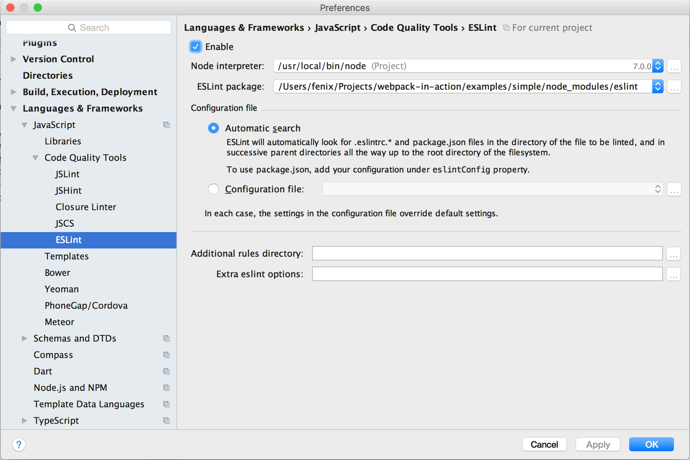

# webpack打包实战

## 写在开头
先说说为什么要写这篇文章, 最初的原因是组里的小朋友们看了[webpack](http://webpack.github.io/)文档后,
表情都是这样的: (摘自webpack[一篇文档](http://webpack.github.io/docs/usage.html)的评论区)


和这样的:


是的, 即使是外国佬也在吐槽这文档不是人能看的. 回想起当年自己啃webpack文档的血与泪的往事,
觉得有必要整一个教程, 可以让大家看完后愉悦地搭建起一个webpack打包方案的项目.

可能会有人问webpack到底有什么用, 你不能上来就糊我一脸代码让我马上搞, 我照着搞了一遍结果根本没什么naizi用,
都是骗人的. 所以, 在说webpack之前, 我想先谈一下前端打包方案这几年的演进历程, 在什么场景下,
我们遇到了什么问题, 催生出了应对这些问题的工具. 了解了需求和目的之后, 你就知道什么时候webpack可以帮到你.
我希望我用完之后很爽，你们用完之后也是.

## 先说说前端打包方案的黑暗历史
在很长的一段前端历史里, 是不存在打包这个说法的. 那个时候页面基本是纯静态的或者服务端输出的,
没有AJAX, 也没有jQuery. 那个时候的JavaScript就像个玩具, 用处大概就是在侧栏弄个时钟,
用media player放个mp3之类的脚本, 代码量不是很多, 直接放在`<script>`标签里或者弄个js文件引一下就行,
日子过得很轻松愉快.

随后的几年, 人们开始尝试在一个页面里做更多的事情. 容器的显示, 隐藏, 切换. 用css写的弹层,
图片轮播等等. 但如果一个页面内不能向服务器请求数据, 能做的事情毕竟有限的, 代码的量也能维持在页面交互逻辑范围内.
这时候很多人开始突破一个页面能做的事情的范围, 使用隐藏的iframe和flash等作为和服务器通信的桥梁,
新世界的大门慢慢地被打开, 在一个页面内和服务器进行数据交互, 意味着以前需要跳转多个页面的事情现在可以用一个页面搞定.
但由于iframe和flash技术过于tricky和复杂, 并没能得到广泛的推广.

直到Google推出Gmail的时候(2004年), 人们意识到了一个被忽略的接口, [XMLHttpRequest](https://developer.mozilla.org/en-US/docs/Web/API/XMLHttpRequest),
也就是我们俗称的AJAX, 这是一个使用方便的, 兼容性良好的服务器通信接口. 从此开始,
我们的页面开始玩出各种花来了, 前端一下子出现了各种各样的库, [Prototype](http://prototypejs.org/), [Dojo](https://dojotoolkit.org/), [MooTools](http://mootools.net/), [Ext JS](https://www.sencha.com/products/extjs/), [jQuery](https://jquery.com/)...
我们开始往页面里插入各种库和插件, 我们的js文件也就爆炸了...

随着js能做的事情越来越多, 引用越来越多, 文件越来越大, 加上当时大约只有2Mbps左右的网速, 下载速度还不如3G网络,
对js文件的压缩和合并的需求越来越强烈, 当然这里面也有把代码混淆了不容易被盗用等其他因素在里面. [JSMin](http://crockford.com/javascript/jsmin), [YUI Compressor](http://yui.github.io/yuicompressor/), [Closure Compiler](https://developers.google.com/closure/compiler/), [UglifyJS](http://lisperator.net/uglifyjs/)
等js文件压缩合并工具陆陆续续诞生了. 压缩工具是有了, 但我们得要执行它, 最简单的办法呢, 就是windows上搞个bat脚本,
mac/linux上搞个bash脚本, 哪几个文件要合并在一块的, 哪几个要压缩的, 发布的时候运行一下脚本,
生成压缩后的文件.

基于合并压缩技术, 项目越做越大, 问题也越来越多, 大概就是以下这些问题:
* 库和插件为了要给他人调用, 肯定要找个地方注册, 一般就是在window下申明一个全局的函数或对象.
  难保哪天用的两个库在全局用同样的名字, 那就冲突了.
* 库和插件如果还依赖其他的库和插件, 就要告知使用人, 需要先引哪些依赖库, 那些依赖库也有自己的依赖库的话,
  就要先引依赖库的依赖库, 以此类推...

恰好就在这个时候(2009年), 随着后端JavaScript技术的发展, 人们提出了[CommonJS](http://wiki.commonjs.org/wiki/Modules/1.1.1)的模块化规范, 大概的语法是: 如果`a.js`依赖`b.js`和`c.js`, 那么就在`a.js`的头部, 引入这些依赖文件:
```js
var b = require('./b');
var c = require('./c');
```
那么变量`b`和`c`会是什么呢? 那就是`b.js`和`c.js`导出的东西, 比如`b.js`可以这样导出:
```js
exports.square = function(num) {
  return num * num;
};
```
然后就可以在`a.js`使用这个`square`方法:
```js
var n = b.square(2);
```
如果`c.js`依赖`d.js`, 导出的是一个`Number`, 那么可以这样写:
```js
var d = require('./d');
module.exports = d.PI; // 假设d.PI的值是3.14159
```
那么`a.js`中的变量`c`就是数字`3.14159`;
具体的语法规范可以查看Node.js的[文档](https://nodejs.org/dist/latest-v6.x/docs/api/modules.html).


但是CommonJS在浏览器内并不适用. 因为`require()`的返回是同步的, 意味着有多个依赖的话需要一个一个依次下载,
堵塞了js脚本的执行. 所以人们就在CommonJS的基础上定义了[Asynchronous Module Definition (AMD)](https://github.com/amdjs/amdjs-api)规范(2011年), 使用了异步回调的语法来并行下载多个依赖项,
比如作为入口的`a.js`可以这样写:
```js
require(['./b', './c'], function(b, c) {
  var n = b.square(2);
  console.log(c); // 3.14159
});
```
相应的导出语法也是异步回调方式, 比如`c.js`依赖`d.js`, 就写成这样:
```js
define(['./d'], function(d) {
  return d.PI;
});
```
可以看到, 定义一个模块是使用`define()`函数, `define()`和`require()`的区别是,
`define()`必须要在回调函数中返回一个值作为导出的东西, `require()`不需要导出东西,
因此回调函数中不需要返回值, 也无法作为被依赖项被其他文件导入, 因此一般用于入口文件, 比如页面中这样加载`a.js`:
```html
<script src="js/require.js" data-main="js/a"></script>
```
以上是AMD规范的基本用法, 更详细的就不多说了(反正也淘汰了~), 有兴趣的可以看[这里](http://requirejs.org/docs/api.html).

js模块化问题基本解决了, css和html也没闲着. 什么[less](http://lesscss.org/),
[sass](http://sass-lang.com/), [stylus](http://stylus-lang.com/)的css预处理器横空出世,
说能帮我们简化css的写法, 自动给你加vendor prefix. html在这期间也出现了一堆模板语言,
什么[handlebars](http://handlebarsjs.com/), [ejs](http://www.embeddedjs.com/),
[jade](http://jade-lang.com/), 可以把ajax拿到的数据插入到模板中, 然后用innerHTML显示到页面上.

托AMD和CSS预处理和模板语言的福, 我们的编译脚本也洋洋洒洒写了百来行. 命令行脚本有个不好的地方,
就是windows和mac/linux是不通用的, 如果有跨平台需求的话, windows要装个可以执行bash脚本的命令行工具,
比如msys(目前最新的是[msys2](http://msys2.github.io/)), 或者使用php或python等其他语言的脚本来编写,
对于非全栈型的前端程序员来说, 写bash/php/python还是很生涩的. 因此我们需要一个简单的打包工具,
可以利用各种编译工具, 编译/压缩js, css, html, 图片等资源. 然后[Grunt](http://gruntjs.com/)产生了(2012年),
配置文件格式是我们最爱的js, 写法也很简单, 社区有非常多的插件支持各种编译, lint, 测试工具.
一年多后另一个打包工具[gulp](http://gulpjs.com/)诞生了, 扩展性更强, 采用流式处理效率更高.

依托AMD模块化编程, SPA(Single-page application)的实现方式更为简单清晰, 一个网页不再是传统的类似word文档的页面,
而是一个完整的应用程序. SPA应用有一个总的入口页面, 我们通常把它命名为`index.html`,
`app.html`, `main.html`, 这个html的`<body>`一般是空的, 或者只有总的布局(layout), 比如下图:


布局会把header, nav, footer的内容填上, 但main区域是个空的容器. 这个作为入口的html最主要的工作是加载启动SPA的js文件,
然后由js驱动, 根据当前浏览器地址进行路由分发, 加载对应的AMD模块, 然后该AMD模块执行, 渲染对应的html到页面指定的容器内(比如图中的main).
在点击链接等交互时, 页面不会跳转, 而是由js路由加载对应的AMD模块, 然后该AMD模块渲染对应的html到容器内.

虽然AMD模块让SPA更容易地实现, 但小问题还是很多的:
* 不是所有的第三方库都是AMD规范的, 这时候要配置`shim`, 很麻烦.
* 虽然RequireJS支持插件的形式通过把html作为依赖加载, 但html里面的``的路径是个问题,
  需要使用绝对路径并且保持打包后的图片路径和打包前的路径不变, 或者使用html模板语言把`src`写成变量,
  在运行时生成.
* 不支持动态加载css, 变通的方法是把所有的css文件合并压缩成一个文件, 在入口的html页面一次性加载.
* SPA项目越做越大, 一个应用打包后的js文件到了几MB的大小. 虽然`r.js`支持分模块打包, 但配置很麻烦,
  因为模块之间会互相依赖, 在配置的时候需要exclude那些通用的依赖项, 而依赖项要在文件里一个个检查.
* 所有的第三方库都要自己一个个的下载, 解压, 放到某个目录下, 更别提更新有多麻烦了.
  虽然可以用[npm](https://www.npmjs.com/)包管理工具, 但npm的包都是CommonJS规范的,
  给后端Node.js用的, 只有部分支持AMD规范, 而且在npm3.0之前, 这些包有依赖项的话也是不能用的.
  后来有个[bower](https://bower.io/)包管理工具是专门的web前端仓库, 这里的包一般都支持AMD规范.
* AMD规范定义和引用模块的语法太麻烦, 上面介绍的AMD语法仅是最简单通用的语法, API文档里面还有很多变异的写法,
  特别是当发生循环引用的时候(a依赖b, b依赖a), 需要使用其他的[语法](http://requirejs.org/docs/api.html#circular)解决这个问题.
  而且npm上很多前后端通用的库都是CommonJS的语法. 后来很多人又开始尝试使用ES6模块规范, 如何引用ES6模块又是一个大问题.
* 项目的文件结构不合理, 因为grunt/gulp是按照文件格式批量处理的, 所以一般会把js, html, css,
  图片分别放在不同的目录下, 所以同一个模块的文件会散落在不同的目录下, 开发的时候找文件是个麻烦的事情.
  code review时想知道一个文件是哪个模块的也很麻烦, 解决办法比如又要在imgs目录下建立按模块命名的文件夹,
  里面再放图片.

到了这里, 我们的主角webpack登场了(2012年)(此处应有掌声).


和webpack差不多同期登场的还有[Browserify](http://browserify.org/). 这里简单介绍一下Browserify,
Browserify的目的是让前端也能用CommonJS的语法`require('module')`来加载js. 它会从入口js文件开始,
把所有的`require()`调用的文件打包合并到一个文件, 这样就解决了异步加载的问题.
那么Browserify有什么不足之处导致我不推荐使用它呢? 主要原因有下面几点:
* 最主要的一点, Browserify不支持把代码打包成多个文件, 在有需要的时候加载.
  这就意味着访问任何一个页面都会全量加载所有文件.
* Browserify对其他非js文件的加载不够完善, 因为它主要解决的是`require()`js模块的问题,
  其他文件不是它关心的部分. 比如html文件里的img标签, 它只能转成[Data URI](https://en.wikipedia.org/wiki/Data_URI_scheme)的形式, 而不能替换为打包后的路径.
* 因为上面一点Browserify对资源文件的加载支持不够完善, 导致打包时一般都要配合gulp或grunt一块使用,
  无谓地增加了打包的难度.
* Browserify只支持CommonJS模块规范, 不支持AMD和ES6模块规范, 这意味旧的AMD模块和将来的ES6模块不能使用.

基于以上几点, Browserify并不是一个理想的选择. 那么webpack是否解决了以上的几个问题呢? 废话,
不然介绍它干嘛. 那么下面章节我们用实战的方式来说明webpack是怎么解决上述的问题的.

## 上手先搞一个简单的SPA应用
一上来步子太大容易扯到蛋, 让我们先弄个最简单的webpack配置来热一下身.

### 安装Node.js
webpack是基于我大Node.js的打包工具, 上来第一件事自然是先安装Node.js了, [传送门->](https://nodejs.org/).

### 初始化一个项目
我们先随便找个地方, 建一个文件夹叫`simple`, 然后在这里面搭项目. 完成品在[examples/simple](examples/simple)目录,
大家搞的时候可以参照一下. 我们先看一下目录结构:
```
├── dist                      打包输出目录, 只需部署这个目录到生产环境
├── package.json              项目配置信息
├── node_modules              npm安装的依赖包都在这里面
├── src                       我们的源代码
│   ├── components            可以复用的模块放在这里面
│   ├── index.html            入口html
│   ├── index.js              入口js
│   ├── libs                  不在npm和git上的库扔这里
│   └── views                 页面放这里
└── webpack.config.babel.js   webpack配置文件
```

打开命令行窗口, `cd`到刚才建的`simple`目录. 然后执行这个命令初始化项目:
```sh
npm init
```
命令行会要你输入一些配置信息, 我们这里一路按回车下去, 生成一个默认的项目配置文件`package.json`.

### 给项目加上语法报错和代码规范检查
我们安装[eslint](http://eslint.org/), 用来检查语法报错, 当我们书写js时, 有错误的地方会出现提示.
```sh
npm install eslint eslint-config-enough --save-dev
```
`npm install`可以一条命令同时安装多个包, 包之间用空格分隔. 包会被安装进`node_modules`目录中.

`--save-dev`会把安装的包和版本号记录到`package.json`中的`devDependencies`对象中,
还有一个`--save`, 会记录到`dependencies`对象中, 它们的区别, 我们可以先简单的理解为打包工具和测试工具用到的包使用`--save-dev`存到`devDependencies`, 比如eslint, webpack. 浏览器中执行的js用到的包存到`dependencies`, 比如jQuery等.
那么它们用来干嘛的?
因为有些npm包安装是需要编译的, 那么导致windows/mac/linux上编译出的二进制是不同的, 也就是无法通用,
因此我们在提交代码到git上去的时候, 一般都会在`.gitignore`里指定忽略node_modules目录和里面的文件,
这样其他人从git上拉下来的项目是没有node_modules目录的, 这时我们需要运行
```sh
npm install
```
它会读取`package.json`中的`devDependencies`和`dependencies`字段, 把记录的包的相应版本下载下来.


这里`eslint-config-enough`是配置文件, 它规定了代码规范, 要使它生效, 我们要在`package.json`中添加内容:
```json
{
  "name": "simple",
  "version": "1.0.0",

  "eslintConfig": {
    "extends": "enough",
    "env": {
      "browser": true,
      "commonjs": true
    }
  }
}

```
业界最有名的语法规范是[airbnb](https://github.com/airbnb/javascript)出品的, 但它规定的太死板了,
比如不允许使用`for-of`和`for-in`等. 感兴趣的同学可以参照[这里](https://www.npmjs.com/package/eslint-config-airbnb)安装使用.

项目里安装了eslint还没用, 我们的IDE和编辑器也得要装eslint插件支持它. [atom](https://atom.io/)需要安装[linter](https://atom.io/packages/linter)和[linter-eslint](https://atom.io/packages/linter-eslint)这两个插件,
装好后重启生效. [WebStorm](https://www.jetbrains.com/webstorm/)需要在设置中打开eslint开关:



### 写几个页面
我们写一个最简单的SPA应用来介绍SPA应用的内部工作原理.
首先, 建立`src/index.html`文件, 内容如下:
```html
<!DOCTYPE html>
<html>
  <head>
    <meta charset="utf-8">
    <meta name="viewport" content="user-scalable=no, initial-scale=1, maximum-scale=1, minimum-scale=1, width=device-width">
    <meta name="format-detection" content="telephone=no">
  </head>

  <body>
  </body>
</html>
```
它是一个空白页面, 注意这里我们不需要自己写`<script src="index.js"></script>`, 因为打包后的文件名和路径可能会变,
所以我们用webpack插件帮我们自动加上.

然后重点是`src/index.js`:
```js
// 引入作为全局对象储存空间的global.js, js文件可以省略后缀
import global from './global';

// Router类, 用来控制页面根据当前URL切换
class Router {
  start() {
    // 点击浏览器后退/前进按钮时会触发window.onpopstate事件, 我们在这时切换到相应页面
    // https://developer.mozilla.org/en-US/docs/Web/Events/popstate
    window.addEventListener('popstate', () => {
      this.load(location.pathname);
    });

    // 打开页面时加载当前页面
    this.load(location.pathname);
  }

  // 前往path, 会变更地址栏URL, 并加载相应页面
  go(path) {
    // 变更地址栏URL
    history.pushState({}, '', path);
    // 加载页面
    this.load(path);
  }

  // 加载path路径的页面
  load(path) {
    // 使用System.import将加载的js文件分开打包, 这样实现了仅加载访问的页面
    // https://gist.github.com/sokra/27b24881210b56bbaff7#code-splitting-with-es6
    // http://webpack.github.io/docs/code-splitting.html
    System.import('./views' + path + '/index.js').then(module => {
      // 加载的js文件通过 export default ... 导出的东西会被赋值为module.default
      const View = module.default;
      // 创建页面实例
      const view = new View();
      // 调用页面方法, 把页面加载到document.body中
      view.mount(document.body);
    });
  }
}

// new一个路由对象, 赋值为global.router, 这样我们在其他js文件中可以引用到
global.router = new Router();
// 启动
global.router.start();
```
[window.onpopstate](https://developer.mozilla.org/en-US/docs/Web/Events/popstate)和[System.import()](https://gist.github.com/sokra/27b24881210b56bbaff7#code-splitting-with-es6)构成了SPA路由控制的核心.

现在我们还没有讲webpack配置所以页面还无法访问, 我们先从理论上讲解一下, 等会弄好webpack配置后再实际看页面效果.
当我们访问 `http://localhost:8010/foo` 的时候, 路由会加载 `./views/foo/index.js`文件, 我们来看看这个文件:
```js
// 引入全局对象
import global from '../../global';

// 引入html模板, 会被作为字符串引入
import template from './index.html';

// 引入css, 会生成<style>块插入到<head>头中
import './style.css';

// 导出类
export default class {
  mount(container) {
    document.title = 'foo';
    container.innerHTML = template;
    container.querySelector('.foo__gobar').addEventListener('click', () => {
      // 调用router.go方法加载 /bar 页面
      global.router.go('/bar');
    });
  }
}
```
借助webpack插件, 我们可以`import` html, css等其他格式的文件, 文本类的文件会被储存为变量打包进js文件,
其他二进制类的文件, 比如图片, 可以自己配置, 小图片作为[Data URI](https://en.wikipedia.org/wiki/Data_URI_scheme)打包进js文件,
大文件打包为单独文件, 我们稍后再讲这块.

其他的`src`目录下的文件大家自己浏览, 拷贝一份到自己的工作目录, 等会打包时会用到.

页面代码这样就差不多搞定了, 接下来我们进入webpack的安装和配置阶段.


### 安装webpack和Babel
我们把webpack和它的插件安装到项目:
```sh
npm install webpack@2.1.0-beta.25 webpack-dev-server@2.1.0-beta.9 html-webpack-plugin html-loader css-loader style-loader file-loader url-loader --save-dev
```
这里, 我们用`@2.1.0-beta.25`指定了webpack版本号,
因为2还在beta, 不指定的话默认会装1. 因为2基本没问题了, 所以就没必要教大家用1了.
那么怎么知道最新的beta版本是哪个呢? 执行下面命令查看:
```sh
npm show webpack versions --json
```
最后一个就是了.

`webpack-dev-server`是webpack提供的用来开发调试的服务器, 让你可以在http://127.0.0.1:8080/这样的url打开页面来调试,
有了它就不用配置nginx了, 方便很多.

`html-webpack-plugin`, `html-loader`, `css-loader`, `style-loader`等看名字就知道是打包html文件, css文件的插件,
大家在这里可能会有疑问, `html-webpack-plugin`和`html-loader`有什么区别, `css-loader`和`style-loader`有什么区别,
我们等会看配置文件的时候再讲.

`file-loader`和`url-loader`是打包二进制文件的插件, 具体也在配置文件章节讲解.

接下来, 为了能让不支持ES6的浏览器(比如IE)也能照常运行, 我们需要安装[babel](http://babeljs.io/),
它会把我们写的ES6源代码转化成ES5, 这样我们源代码写ES6, 打包时生成ES5.
```sh
npm install babel-core babel-preset-latest babel-loader --save-dev
```
这里`babel-core`顾名思义是babel的核心编译器. `babel-preset-latest`是一个配置文件, 意思是转换[ES2015](http://exploringjs.com/es6/)/[ES2016](https://leanpub.com/exploring-es2016-es2017/read)/[ES2017](http://www.2ality.com/2016/02/ecmascript-2017.html)到ES5, 是的, 不只ES6哦.
babel还有[其他配置文件](http://babeljs.io/docs/plugins/). 如果只想用ES6, 可以安装`babel-preset-es2015`:
```sh
npm install babel-preset-es2015 --save-dev
```
但是光安装了`babel-preset-latest`, 在打包时是不会生效的, 需要在`package.json`加入这些内容:
```json
{
  "name": "simple",
  "version": "1.0.0",

  "babel": {
    "presets": [
      [
        "latest",
        {
          "modules": false
        }
      ]
    ]
  }
}
```
打包时babel会读取`package.json`中`babel`字段的内容, 然后执行相应的转换.
这里的`"modules": false`配置是禁止babel转ES6模块语法到CommonJS语法, 因为webpack 2支持ES6模块.

如果使用`babel-preset-es2015`, 这里相应的也要修改为:
```json
{
  "name": "simple",
  "version": "1.0.0",

  "babel": {
    "presets": [
      [
        "es2015",
        {
          "modules": false
        }
      ]
    ]
  }
}
```

`babel-loader`是webpack的插件, 我们下面章节再说.


### 配置webpack
包都装好了, 接下来, 总算可以进入正题了, 是不是有点心累...呵呵.
我们来创建webpack配置文件`webpack.config.babel.js`, 这里文件名里有`babel`, webpack会识别文件里的ES6语法.
我们来看文件内容:
```js
```


### 浏览器里看看效果
我们打开命令行窗口, `cd`到examples/simple目录, 然后安装依赖包:
```sh
npm install
```
npm会把`package.json`中`dependencies`和`devDependencies`记录的包下载到`node_modules`目录.


## 来搞一个大项目
